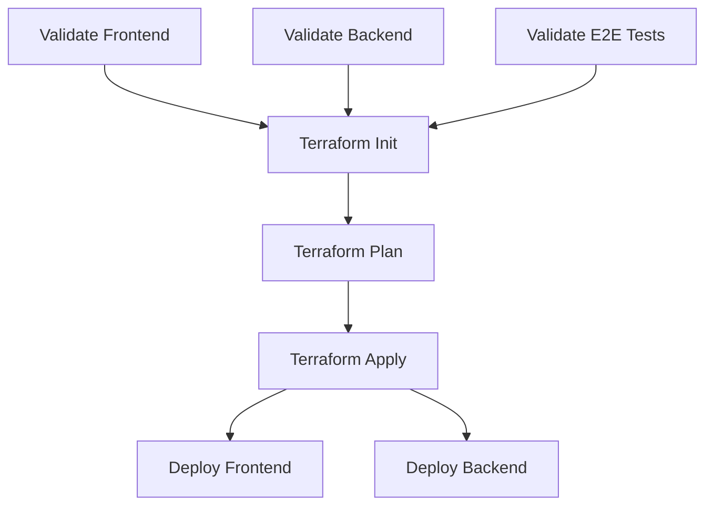

# Deployment Architecture

The build and release pipelines are all controlled via GitHub actions which act as our CI/CD process.

The actions are categorised into different types:
- **Validate**: Perform some sort of validation, such as running tests and are typically pass/fail
- **Generate**: Generate some sort of artifact, such as reporting
- **Deploy**: Perform a deployment to a target environment

## Build Pipeline

On creation of a Pull Request or push to main, multiple validation actions run, depending on what areas of the repo
have been modified. Any failures should be addressed before merging. Failures on main should be fixed as priority.

The following checks/actions run on every pull request or main push:
- **API .NET Build** - Builds the solution and runs unit/integration tests. Pass or fail.
- **React Build** - Builds the React application and runs tests. Pass or fail.
- **E2E Tests** - Runs the end-to-end tests against a site on docker compose. Pass or fail.

## Release Pipeline

Once the team is happy to release, they can request this via workflow dispatch. This will trigger the deployment pipeline
and run the following steps:

